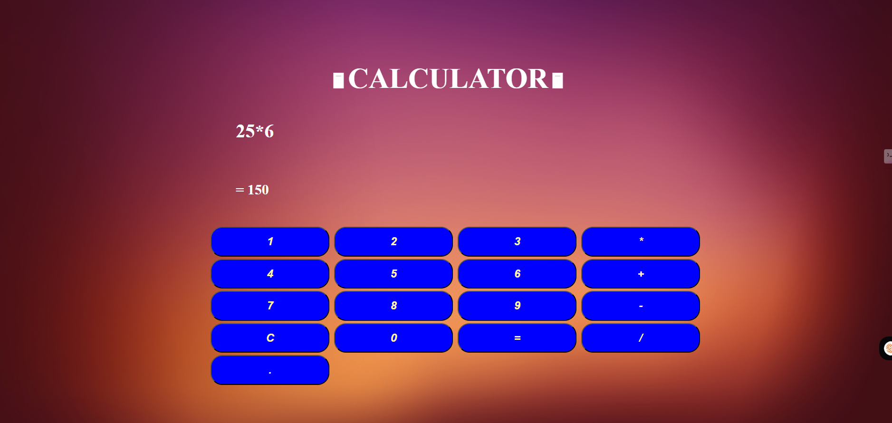

# 🖩 Calculator Web App

A simple and interactive **web-based calculator** built using **HTML**, **CSS**, and **JavaScript**. It supports basic arithmetic operations and provides a user-friendly experience.

## 🎯 Project Purpose

This project aims to create an accessible and functional web-based calculator for users to perform basic mathematical operations such as addition, subtraction, multiplication, and division. It is designed to be easy to use and visually appealing with a responsive layout.

## 🚀 Features

- **Basic Arithmetic Operations**: `+`, `-`, `*`, `/`
- **Responsive Design**: Works on both desktop and mobile devices
- **Interactive Buttons**: Clickable buttons for each operation and number
- **Clear Button**: Resets the current input
- **Decimal Support**: Input decimals for more precision
- **Error Handling**: Displays an error message for invalid inputs

## 🛠 Technologies Used

- **HTML5**: Structure and layout of the page
- **CSS3**: Styling and layout design
- **JavaScript**: Logic for calculations and handling user inputs


## 📸 Preview

![Calculator Screenshot]


## ⚙️ Installation & Setup

To run this project locally on your machine:

1. **Clone the repository**:
   ```bash
   git clone https://github.com/your-username/Mini-Projects.git
   cd Mini-Projects/Calculator


---

### Next Steps for You:

1. **Replace placeholders** like `your-username` and `screenshot.png` with actual information.
2. **Add a screenshot** of your calculator to the repository, either in the same folder or a dedicated `images/` folder, and update the path in the `README.md` (e.g., ``).
3. **Push the changes to GitHub**:
   - If you haven't already, add, commit, and push the `README.md` file to your GitHub repo:
     ```bash
     git add README.md
     git commit -m "Update README.md for Calculator project"
     git push origin main
     ```

